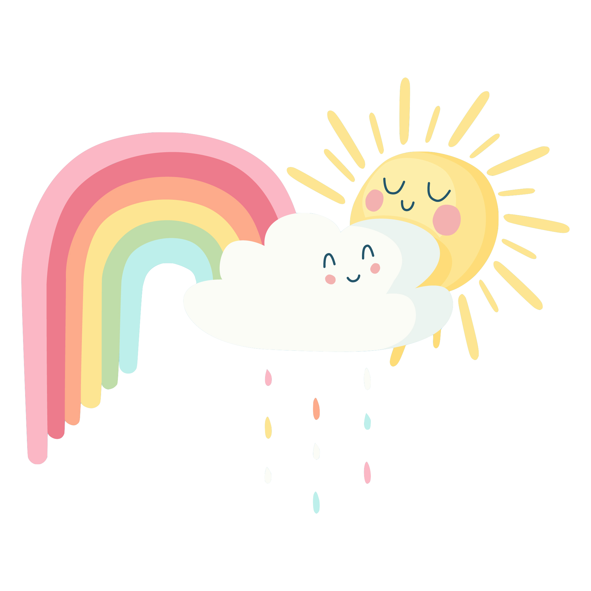

---

## YAY – Awesome Day

"YAY – Awesome Day" is an app to collect all your favourite thoughts and memories. Because sometimes, one just tends to forget that there is beauty and joy in each and every day, no matter how rough. 

This app was developed as my capstone project during the final three weeks of the [neuefische Web Developer Bootcamp](https://www.neuefische.de) in May, 2020.

When viewing this app, please switch your browser to iPhone 6/7/8 mode, as it was developed and optimized for mobile use.

## Tech stack, dependencies & more

- Framework: React
- Hosting: Firebase
- styled-components
- react-router-dom
- Storybook
- local storage
- prop-types
- cypress
- testing-library
- jest

## You want to set it up?

Just follow these instructions:

1. Clone this repository  
   `git@github.com:kwartalex/capstone-project.git`
2. Install dependencies
   `npm install`
3. Run the application with  
   `npm start`
4. Run Storybook with  
   `npm run storybook`
5. Run Cypress with  
   `npm run cypress`
6. Run React Testing Library & Jest with  
   `npm test`

## This is a react app

This project was bootstrapped with [Create React App](https://github.com/facebook/create-react-app).